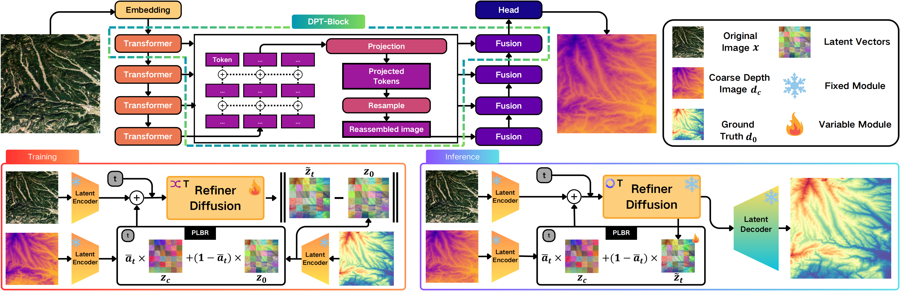
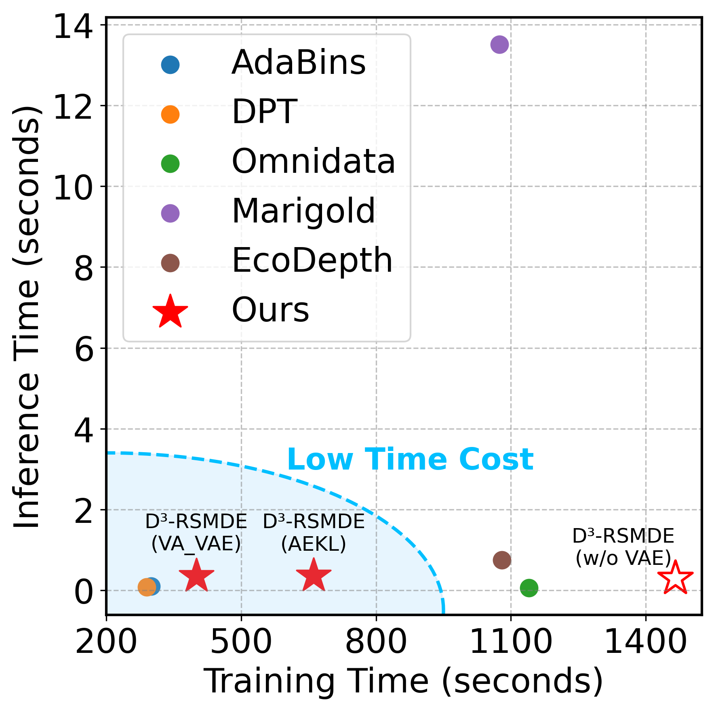
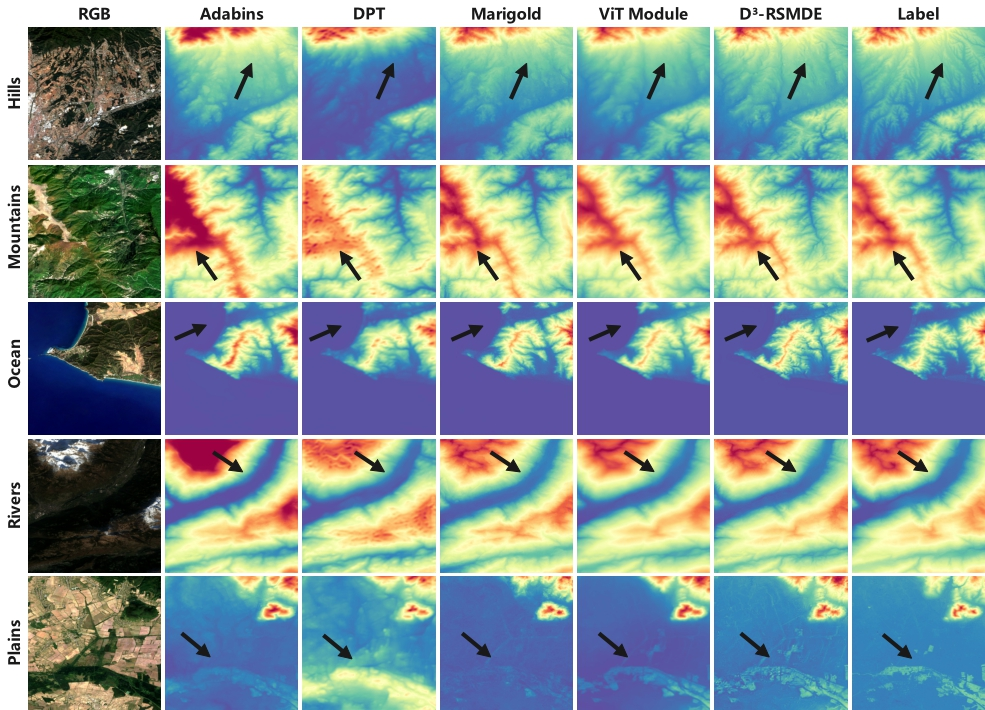

# D³-RSMDE: 40× Faster and High-Fidelity Remote Sensing Monocular Depth Estimation
## Overview
We propose **D**epth **D**etail **D**iffusion for **R**emote **S**ensing **M**onocular **D**epth **E**stimation (D³-RSMDE), an efficient framework designed to achieve an optimal balance between speed and quality.   Our framework first leverages a ViT-based module to rapidly generate a high-quality preliminary depth map construction, which serves as a structural prior, effectively replacing the time-consuming initial structure 
generation stage of diffusion models.   Based on this prior, we propose a **P**rogressive **L**inear **B**lending **R**efinement (PLBR) strategy, hich uses a lightweight U-Net to refine the details in only a few iterations.   The entire refinement step operates efficiently in a compact latent space supported by a Variational Autoencoder (VAE).   Extensive experiments demonstrate that D³-RSMDE achieves a notable 11.85% reduction in the Learned Perceptual Image Patch Similarity (LPIPS) perceptual metric over leading models like Marigold, while also achieving over a 40× speedup in inference and maintaining VRAM usage comparable to lightweight ViT models.



## [Project URL](https://anonymous.4open.science/api/repo/D3RSMDE-5547/file/index.html?v=0)

For a more detailed comparison, we highly recommend visiting our **[Project URL](https://anonymous.4open.science/api/repo/D3RSMDE-5547/file/index.html?v=0): https://anonymous.4open.science/api/repo/D3RSMDE-5547/file/index.html?v=0**, which has a gallery for a more detailed comparison of the outputs of different models. (**Note that you need to refresh the page after clicking the link to avoid seeing only 404**)

## Project Structure

```
D3RSMDE/
├── Config/                    (Configuration File directory)
├── Dataset/                   (Dataset directory)
│   ├── BASE_DATA_DIR/        (Remote Scene Dataset directory)
│   └── splitTextFiles/       (Dataset split file)
├── Modules/                   (Core modules directory)
├── Utils/                     (Utility Functions directory)
├── output/                    (Training Output directory)
├── results/                   (Evaluation Results directory)
├── trainViT.py               (Training ViT model script)
├── trainDiffusion.py         (Training Diffusion model script)
├── evaluateViT.py            (Evaluating ViT model script)
└── evaluateDiffusion.py      (Evaluating Diffusion model script)
```
## Train D³ ViT
The ViT model first needs to be trained to generate preliminary depth maps that will serve as structural priors for the diffusion model. In order to perform fair k-fold cross-validation, the data splitting parameters need to be set in the configuration file.
### Description of Configuration Parameters
- dataset_path: Dataset path
- batch_size: The batch size
- lr: Learning rate
- threshold_epoch: The threshold number of rounds at which the learning rate decays
- downgrade_lr_ratio: learning rate decay ratio
- weight_decay: The weight decays
- epochs: Number of training rounds
- seed: Random seed
- num_workers: number of data loader workers
- loss_types: Types of loss functions
- save_n_epoch: Save the model every n epochs
- split_text: list of training set split files (for k-fold cross validation)
- val_split_text: A list of validation split files
- pretrained_model_path: Pre-trained model path
- not_split: Whether to not split the data
### K-fold cross-validation setup
In the configuration file, the split_text and val_split_text parameters are used to implement k-fold cross-validation:

- split_text : Specifies the data split file to use as the training set
- val_split_text : Specifies the data split file to use as the validation set

For example, in the Config/ViT trainImageToDEM - Swi2_512. Json:

```
"split_text": [
  "Dataset/Swi2_512/Swi2_512stage1-2.txt",
  "Dataset/Swi2_512/Swi2_512stage1-3.txt",
  "Dataset/Swi2_512/Swi2_512stage1-4.txt",
  "Dataset/Swi2_512/Swi2_512stage1-5.txt"
],
"val_split_text": [
  "Dataset/Swi2_512/Swi2_512stage1-1.txt"
]
```
This splits the original training set into five parts and uses four of them as the training set and one as the validation set. If you need to get the output of the original test set, you should not add the split_text and val_split_text parameters.

### Running the command
```
python trainViT.py --config Config/ViT/your_config_file.json
```
## Evaluate D³ ViT
Once training is complete, the performance of the ViT model needs to be evaluated and a depth map for diffusion model training needs to be generated.

### Description of Configuration Parameters
- dataset_path : Dataset path
- seed : Random seed
- num_workers : Number of data loader worker processes
- output_dir : Output directory
- checkpoint_path : Model checkpoint paths
- test_split_text : List of test split files (used to get the corresponding output data)
### Running the command
```
python evaluateViT.py --config Config/ViT/your_config_file.json
```
## Train D³ Diffusion
After obtaining a preliminary depth map generated by ViT, a diffusion model is trained to perform detail optimization.

### Description of Configuration Parameters
- dataset_path : Dataset path
- batch_size : Batch size
- lr : Diffusion model learning rate
- vae_lr : VAE Learning Rate
- threshold_epoch : Number of threshold rounds for learning rate decay
- downgrade_lr_ratio : Learning rate decay ratio
- weight_decay : Weight decay
- dropout : Dropout ratio
- epochs : Number of training rounds
- seed : Random seed 
- num_workers : Number of data loader worker processes
- save_n_epoch : The model is saved every n epochs
- diffusion_cfg : Diffusion model configuration
  - diff_iter : Number of diffusion iterations
  - betas : Noise scheduling parameter
    - start : Starting beta value
    - stop : End beta value
    - num_timesteps : Number of time steps
- pretrained_model_path : Pre-trained model paths
- vae_type : VAE type ("AutoencoderKL" or "VA_VAE")
- vae_path : VAE model path
### Running the command
```
python trainDiffusion.py --config Config/Diffusion/your_config_file.json
```
## Evaluate Ours Diffusion

### Description of Configuration Parameters
- dataset_path : Dataset path
- seed : Random seed
- num_workers : Number of data loader worker processes
- output_dir : Output directory
- diffusion_cfg : Diffusion model configuration (same as training configuration)
- checkpoint_path : Model checkpoint paths
- vae_type : VAE type
- vae_path : VAE model path
### Running the command
```
python evaluateDiffusion.py --config Config/Diffusion/your_config_file.json
```

## The Dataset We Used

The figure shows the locations of the five data sets we used, and the generation effects of the model. They are: Japan + Korea (2,650 pairs, coastal mountainous terrain, 30 m resolution, J&K), Southeast Asia (7,000 pairs, plains and hills, 30 m resolution, SA), Mediterranean (29,225 pairs, desert and plateau, 30 m resolution, Med), Australia (1,249 pairs, plain, 5m resolution, Ast), Switzerland (4,827 pairs, mountain, 2m resolution, Swi).

## Experimental Results
### Quantitative Results
Quantitative comparison with SOTA methods on the SA dataset. The best result is highlighted in **bold** and the second best result is <u>underlined</u>.*

| Model | MAE SA ↓ | δ³ SA ↑ | PSNR SA ↑ | LPIPS SA ↓ |
| :--- | :---: | :---: | :---: | :---: |
| Adabins | 28.4 | 68.9 | 17.4 | 0.405 |
| DPT | 34.2 | 62.5 | 16.7 | 0.604 |
| Omnidata | 30.7 | 67.8 | 18.5 | 0.482 |
| Pix2pix | 39.3 | 55.1 | 15.2 | 0.485 |
| Marigold | 23.7 | <u>71.7</u> | 19.6 | <u>0.326</u> |
| EcoDepth | 49.0 | 49.4 | 13.3 | 0.428 |
| **D³-RSMDE (VA_VAE)** | <u>21.7</u> | 70.0 | <u>20.1</u> | 0.366 |
| **D³-RSMDE (AEKL)** | **21.6** | **72.1** | **20.2** | **0.325** |

### Efficiency Analysis
The training/inference time/VRAM analysis:




## Visual Results
The model generates high-quality depth maps with fine details while maintaining computational efficiency. The Progressive Linear Blending Refinement (PLBR) strategy effectively enhances the depth estimation quality in just a few diffusion iterations, achieving superior perceptual quality compared to existing methods.
 